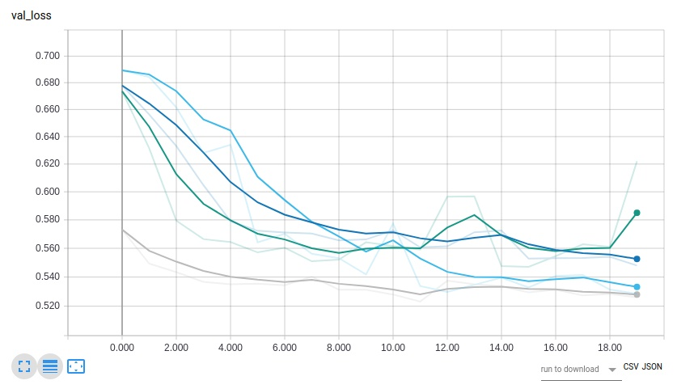
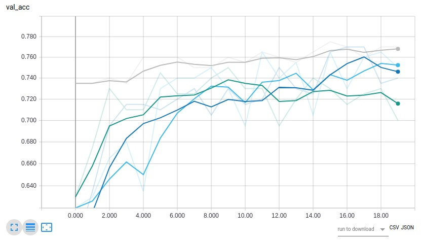
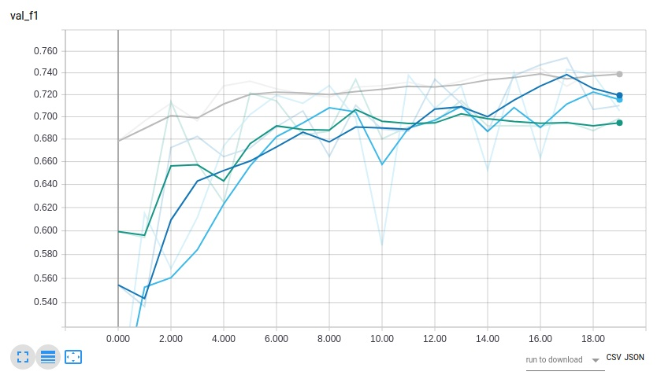
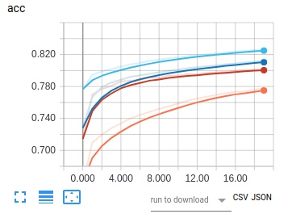

# Description:
Sentiment Detection is the assignment of emotion label to a set of statements.  e.g. "I am happy" would generally be described as positive sentiment.  The types of sentiment label depends on the corpus domain and availability of data mapping to those sentiments.  Sentiment has many applications ranging from evaluating customer product feedback to evaluating response to political figures/statements/positions to predicting stock markets.  It is also a common machine learning exercise/example/case study used by several different ml frameworks.

# Purpose:
* Use keras to explore deep learning as pertains to sentiment detection
* Develop intuition around tuning hyperparameters
* Assess different sentiment and nlp techniques to improve performance

## Dependencies
* see requirements.txt for pip dependencies
* currently runs on tensorflow backend(see https://keras.io/backend/)
* Keras 2.x
* python3

## Running
1. uncompress data/training.1600000.processed.noemoticon.csv.tar.gz
2. pip install dependencies(note: if you use virtualenv, set that up)
3. setup data files for training data, test data, and word embeddings
4. run python3 sentiment.py 

# Performance/Results:

## Comparison of Different Model Arch
* dark blue = dense(128) w/ sgd
* green = conv1d layer and max pooling w/ sgd 
* light blue = single lstm w/ sgd
* gray = bidirectional dual layer lstm w/ adam

## Effect of Word Embeddings
* light blue = fasttext w/ ~1 million training cases
* dark blue = glove w/ ~1 million training cases
* red/orange = fasttext w/ 100k training cases
* orange = glove w/ 100k training cases

# Ideas for Future Improvements:
* use of domain specific training/test data i.e. from production
* sentiment specific word embeddings
* training w/ larger compute & larger training/test set
* sarcasm detection as a separate model/pipeline

