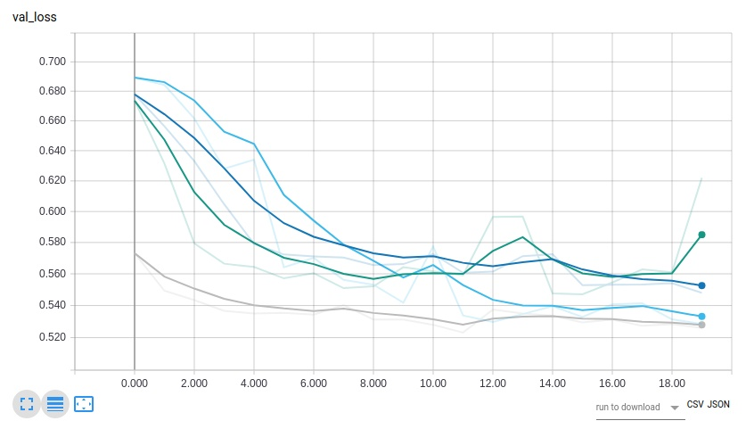
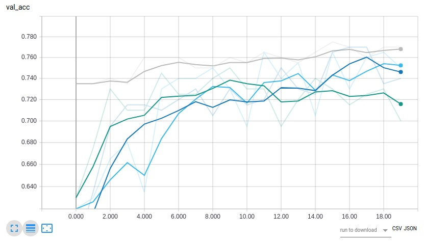
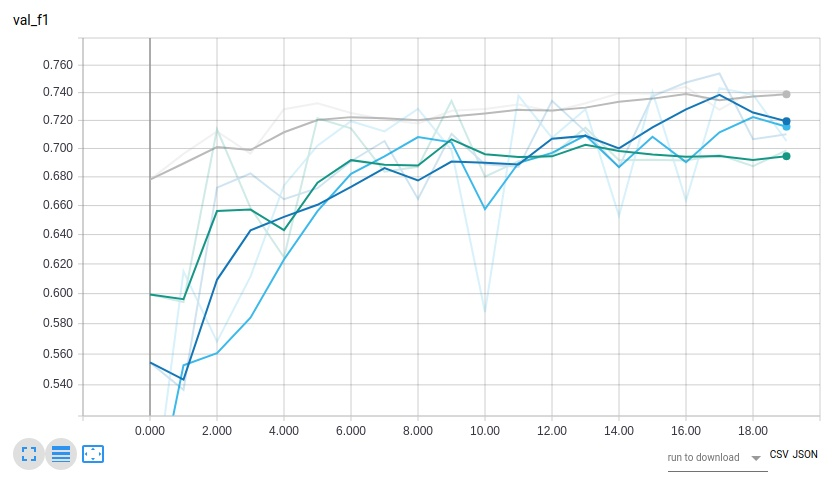

# Description:
Sentiment Detection is the assignment of emotion label to a set of statements.  e.g. "I am happy" would generally be described as positive sentiment.  The types of sentiment label depends on the corpus domain and availability of data mapping to those sentiments.  Sentiment has many applications ranging from evaluating customer product feedback to evaluating response to political figures/statements/positions to predicting stock markets.  It is also a common machine learning exercise/example/case study used by several different ml frameworks.

# Purpose:
* Use keras to explore deep learning as pertains to sentiment detection
* Develop intuition around tuning hyperparameters
* Assess different sentiment and nlp techniques to improve performance

# Problem Discussion:
For this project, twitter data set was used since its free and easily parse-able.  The advantage of this is that the sentiment of twitter data is self-reported via emoticon e.g. a ":-)" would be considered positive sentiment and ":-(" would be considered negative sentiment. 

Twitter data has several challenges: 
1. Test data is a different distribution than the training data i.e. test data contains neutral sentiment whereas training does not
2. Corpus contains many abbreviations and acronyms used colloquially
3. Punctuations have meaning within the context of tweets
4. Mis-spellings are frequent and often contextually important e.g. "LOOOOVVVE"
5. Context of tweets i.e. irony or sarcasm is difficult to train.  Example:  "Lebron is murdering it :-)"
Source: http://help.sentiment140.com/for-students/

Model Evaluated On:
* loss
* accuracy
* recall
* precision
* f1 score

# Design/Architecture:

A dual layer bi-direction LSTM followed by a couple of dense layers was used.  Bi-directional was chosen since literature shows that unidirectional lstm tends to favor data later in the sequence.

|Layer (type)                 |Output Shape              |numParam  |  
|---|:---:|---
|embedding_1 (Embedding)      |(None, 100, 128)          |640384    |
|bidirectional_1 (Bidirection |(None, 100, 256)          |263168    |
|bidirectional_2 (Bidirection |(None, 256)               |394240    |
|dense_1 (Dense)              |(None, 128)               |32896     |
|dense_2 (Dense)              |(None, 1)                 |129       |


* Total params: 1,330,817
* Trainable params: 1,330,817
* Non-trainable params: 0

## Why not Convolutional?  

For a few reasons:  Firstly, Convolutional Neural Networks(CNN) don't seem to handle sequentially dependent data quite as well as sequence models.  Secondly, experimentation showed that while CNN layers converged over fewer epochs as the number of epochs increased the loss would eventually diverge.  While I didn't explore the entire CNN hyperparameter space, reducing the learning rate achieved similar though not quite as good results against LSTM style networks.  For this problem it is a tradeoff between faster training vs higher accuracy.  It seems possible to achieve similar results within this limited domain so it is a matter of preference as to which family of ANN to pursue.  Since LSTM is more in the sequence family and experimentation showed better accuracy I went in this direction.

Choice of Optimizing function was determined experimentally

## Word Embeddings
Word embeddings are a technique of taking a prior learned relationship between different word(usually in the form of mapping of words to vectors and calculated beforehand).  I was curious as to the impact of different types of word embeddings on accuracy.  Literature seemed to indicate that domain specific word embeddings lead to higher results.  Pre-trained word embeddings are available to freely download.  Alternatively, you can train your own word embeddings from your corpus using facebook's fasttext(https://fasttext.cc/docs/en/unsupervised-tutorial.html) or alternatively spacey(https://spacy.io/usage/vectors-similarity).  This last approach was to address several challenges shown above.  Literature and experimentation seems to show that skipgram does better than cbow(continuous bag of words) in training word embeddings.  The twitter training data was stripped of metadata and concatenated together.  The entirety of this corpus was used as input into fasttext word embeddings

### Training Word Embeddings

* Download fasttext(see references)
* Parse data in a corpus for training(i.e. remove any unnecessary metadata). 
* Run below line

```bash
./fasttext skipgram -input data/twitter_corpus.txt -output result/twitter_corpus
```

# Training Methodology

* Data handling:
    1. Training data is ordered and a different distribution from test data. i.e. test data is 1. shuffled and 2. contains neutral scores whereas training data does not.
    2. Half of the test data is shuffled into the training data while the other half is retained as test data
    3. Training data is shuffled and divided into 'train' and 'dev'(referred to as 'holdout' in code)
    4.  Computational limitations required smaller data set in turn limits accuracy. This made the entire train set(including dev only 100k training samples)
* Epochs and mini-batches
    * epochs and mini-batches similar to original source code
    * number of epochs was set 20 because as seemed a little after the point where majority of models seemed to plateau in accuracy

## Dependencies
* see requirements.txt for pip dependencies
* currently runs on tensorflow backend(see https://keras.io/backend/)
* Keras 2.x
* python3

## Running
1. uncompress data/training.1600000.processed.noemoticon.csv.tar.gz
2. pip install dependencies(note: if you use virtualenv, set that up)
3. setup data files for training data, test data, and word embeddings
4. run python3 sentiment.py 

# Performance/Results:
* dark blue = dense(128) w/ sgd
* green = conv1d layer and max pooling w/ sgd 
* light blue = single lstm w/ sgd
* gray = bidirectional dual layer lstm w/ adam






# Ideas for Future Improvements:
* use of domain specific training/test data i.e. from production
* sentiment specific word embeddings
* training w/ larger compute & larger training/test set
* sarcasm detection as a separate model/pipeline

# References:
* [sentiment specific word embeddings:](https://github.com/attardi/deepnl/wiki/Sentiment-Specific-Word-Embeddings)
* [good resources for sentiment stuff:](https://github.com/laugustyniak/awesome-sentiment-analysis)
* [original glove data:](https://nlp.stanford.edu/projects/glove/)
* [pretrained glove:](http://nlp.stanford.edu/data/glove.twitter.27B.zip)
* [fasttext](https://fasttext.cc/docs/en/unsupervised-tutorial.html)
* [spacey](https://spacy.io/usage/vectors-similarity)
* [twitter sentiment data](http://help.sentiment140.com/for-students/)
* Ng, A. 2018, "Deep Learning Specialization", Coursera, Homework/Lecture Notes, viewed 28 March 2018, <https://www.coursera.org/specializations/deep-learning>
* LSTM paper:  Gers, F. A., Schmidhuber, J., and Cummins, F. (2000). Learning to forget: Continual prediction with LSTM. Neural Computation, 12(10):2451–2471.
* Twitter paper:  Pak, A & Paroubek, P. (2010) Twitter as a Corpus for Sentiment Analysis and Opinion Mining. (European Language Resources Association (ELRA), Valletta, Malta).
